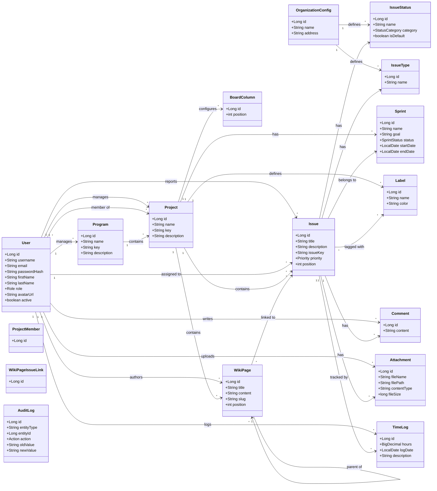
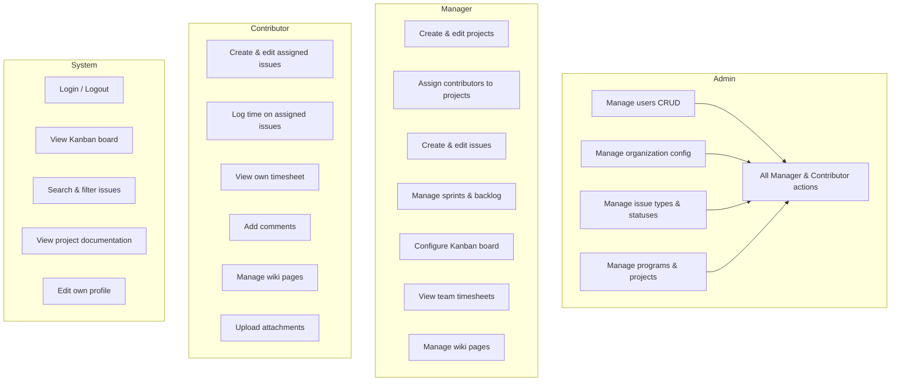
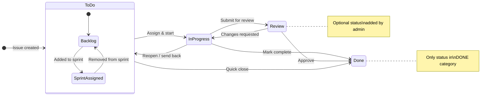
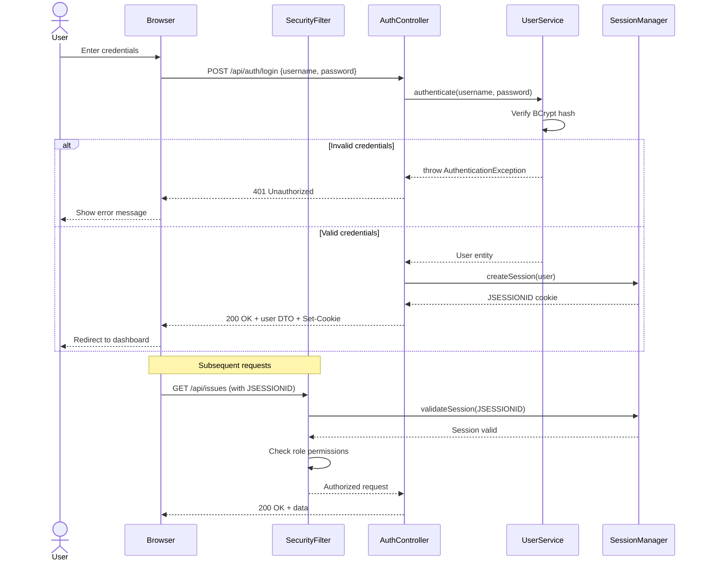
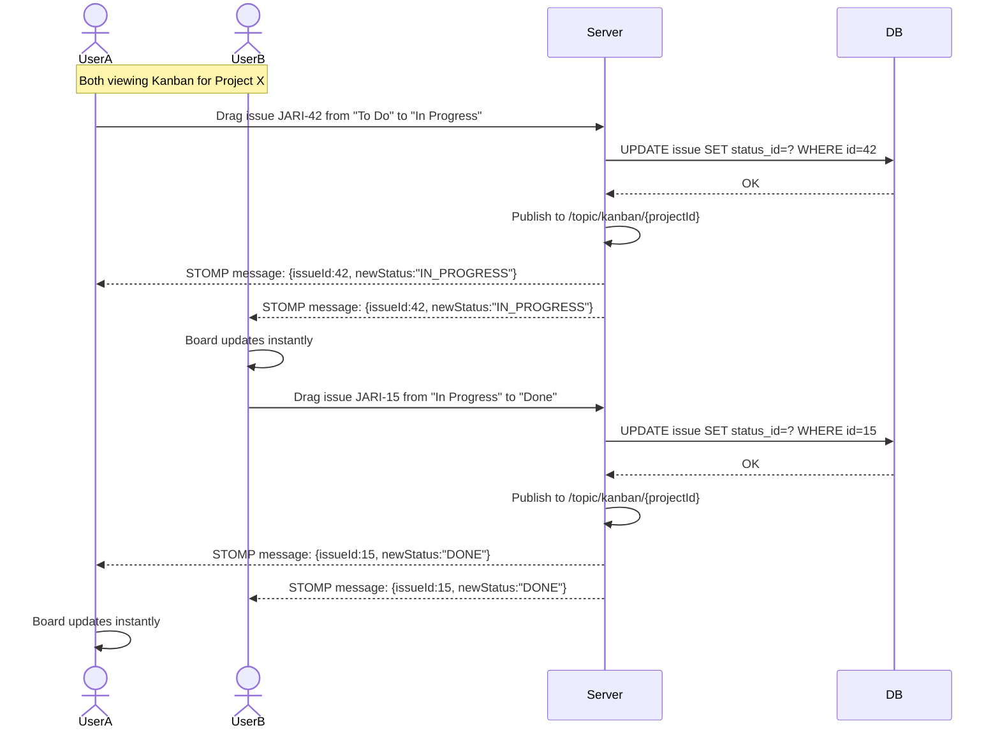
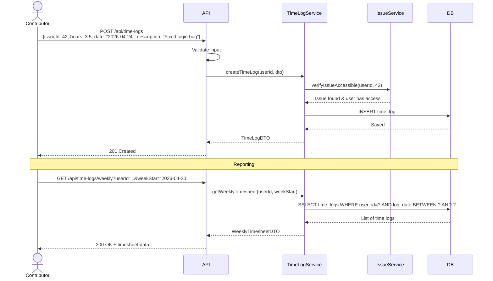

# Jari — UML Diagrams

All diagrams use [Mermaid](https://mermaid.js.org/) syntax. Render them in GitHub, VS Code (with Mermaid extension), or [mermaid.live](https://mermaid.live).

---

## 1. Domain Model (Class Diagram)

Core entities and their relationships.

---

## 2. Use Case Diagram

What each role can do.

---

## 3. Issue Lifecycle (State Diagram)

How an issue moves through statuses.

> Note: "Review" is an example of a custom status. The core statuses are To Do → In Progress → Done, but admins can add intermediate ones via `issue_status` configuration.

---

## 4. Authentication Flow (Sequence Diagram)

---

## 5. Kanban Real-Time Update (Sequence Diagram)

How WebSocket keeps boards in sync across clients.

---

## 6. Backend Package Structure (Component Diagram)

```mermaid
flowchart TB
    subgraph jari-backend
        direction TB

        subgraph common
            STORAGE[StorageService<br/>FilesystemStorage]
            AUDIT[Audited<br/>annotation]
            EXC[GlobalExceptionHandler]
            DTO[DTOs & Mappers]
        end

        subgraph config
            SECURITY[SecurityConfig]
            WEBSOCKET[WebSocketConfig]
            CORS[CORS Config]
        end

        subgraph security
            AUTH_FILTER[AuthFilter]
            RBAC[RoleAuthorization]
        end

        subgraph user
            UC[UserController]
            US[UserService]
            UR[UserRepository]
        end

        subgraph program
            PC[ProgramController]
            PS[ProgramService]
            PR[ProgramRepository]
        end

        subgraph project
            PJC[ProjectController]
            PJS[ProjectService]
            PJR[ProjectRepository]
        end

        subgraph issue
            IC[IssueController]
            IS[IssueService]
            IR[IssueRepository]
        end

        subgraph sprint
            SC[SprintController]
            SS[SprintService]
            SR[SprintRepository]
        end

        subgraph timetracking
            TC[TimeLogController]
            TS[TimeLogService]
            TR[TimeLogRepository]
        end

        subgraph documentation
            WC[WikiPageController]
            WS[WikiPageService]
            WR[WikiPageRepository]
        end

        subgraph attachment
            AC[AttachmentController]
            AS[AttachmentService]
            AR[AttachmentRepository]
        end
    end

    STORAGE -.-> AS
    AUDIT -.-> IS
    AUDIT -.-> TS
    EXC -.-> IC & TC & WC
```

---

## 7. Time Tracking Flow (Sequence Diagram)

